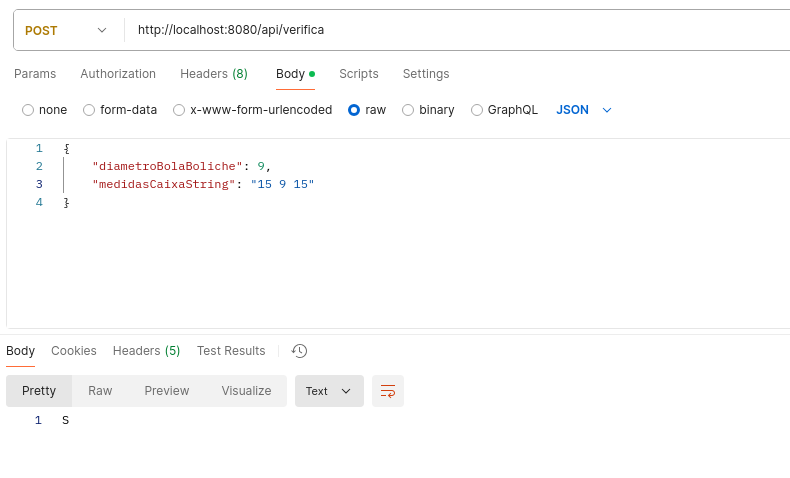

<br />
<div align="center" id="top">
  <a href="https://linkedin.com/in/ldnovaes">
    
  </a>

  <h3 align="center">Teste Técnico Buson</h3>

  <p align="center">
    Este projeto se consiste em demonstrar parte das minhas habilidades com Spring Boot para tentativa de continuar no processo seletivo com a Buson
    <br />
    <br />
  </p>
</div>


<!-- TABLE OF CONTENTS -->
<details>
  <summary>Conteúdo</summary>
  <ol>
    <li>
      <a href="#sobre">Sobre o Projeto</a>
      <ul>
        <li><a href="#ferramentas">Ferramentas Utilizadas</a></li>
      </ul>
    </li>
    <li>
      <a href="#comeco">Começando</a>
      <ul>
        <li><a href="#teste">O Teste Técnico</a></li>
        <li><a href="#requisitos">Requisitos</a></li>
        <li><a href="#deploy">Deploy</a></li>
      </ul>
    </li>
    <li><a href="#licenca">Licença</a></li>
    <li><a href="#contato">Contato</a></li>
  </ol>
</details>


<!-- ABOUT THE PROJECT -->
## <span id="sobre">Sobre o Projeto</span>

Trata-se de um projeto com fins processuais referente a um processo seletivo com a Buson. O teste técnico não exigia exatamente o uso do Spring, mas ainda assim quis aproveitar a oportunidade para demonstrar, mesmo que mínima, as minhas habilidades com Spring Boot, Docker e também um certo cuidado com o usuário. Não apenas a listagem aqui falada, mas eu também quis demonstrar um pouco a minha habilidade e conhecimento em estar configurando o Swagger e também o cuidado que eu teria em documentar uma API. Eu devolvo mensagens informando exatamente onde ele pode ter errado para devidas tratativas.


### <span id="ferramentas">Ferramentas Utilizadas</span>

* 
* 
* 

<p align="right">(<a href="#top">Topo</a>)</p>

## <span id="comeco">Começando</span>

Assumindo que você tenha as ferramentas supracitadas, aqui daremos início ao projeto.

#### <span id="teste">O Teste Técnico</span>

O teste consiste em dado uma entrada, o código devolver uma saída

*Entrada*
> A primeira linha da entrada contém um inteiro N (1 ≤ N ≤ 10.000) que indica o diâmetro da bola de boliche. A segunda linha da entrada contém 3 números inteiros separados por um espaço cada: a altura A (1 ≤ A ≤ 10.000), seguida da largura L (1 ≤ L ≤ 10.000) e da profundidade P (1 ≤ P ≤ 10.000).

*Saída*
> Seu programa deve imprimir uma única linha, contendo a letra 'S' caso a bola de boliche caiba dentro da caixa ou 'N' caso contrário.

#### <span id="requisitos">Requisitos</span>

Primeiro, é preciso ter o projeto em uma pasta separada em seu computador. Clone o repositório nesse local escolhido:

```sh
git clone https://github.com/ldnovaes/teste-tecnico-buson.git
```

#### <span id="deploy">Deploy</span>

O projeto foi construído para rodar em um container docker. Ele é auto-implantável. Fiz isso para facilitar os testes que a equipe responsável irá realizar:

```sh
docker-compose up -d
```

O argumento `-d` permite a execução do container mesmo que o seu terminal esteja fechado.

Feito isso, o projeto poderá ser executado com o postman. Deixarei alguns exemplos das entradas com imagens:

#### ENTRADA COM VALOR ACIMA DE 10.000


#### ENTRADA COM VALOR FALTANDO (Altura x Largura x Profundidade)


#### ENTRADA COM VALORES SEPARADOS POR ESPAÇO 


#### ENTRADA COM VALORES ENVIADOS POR ARRAY  


#### DEMONSTRATIVO DE AVISO EM QUAL MEDIDA NÃO FOI POSSIVEL ENCAIXAR A BOLA


<p align="right">(<a href="#top">Topo</a>)</p>

## <span id="uso">Entendendo o Projeto</span>

É importante saliente que por ordem de prioridade, o código sempre irá olhar primeiramente ao Array passado e não as medidas passadas por String divididas por espaços. Isso se deve a minha implementação e isso poderia facilmente ser modificado. 

Outro ponto a ser levado em conta foi o método POST utilizado no endpoint. Visto que o GET poderia ser facilmente tratado essa questão e nem precisaríamos criar um OBJETO representando uma MODEL. Sim, isso é fato, no entanto eu pouco conseguiria demonstrar meu conhecimento com alternativas propostas pela comunidade, como é o caso do LOMBOK que eu utilizei. A escolha da model foi justamente a demonstração do LOMBOK e meu conhecimento em aproveitar bibliotecas famosas ou não do java para o Spring.

Outro ponto a tentarmos entender é que eu até dividi as camadas, na tentativa de realmente criar uma arquitetura, mesmo que mínima. 

Também apliquei meu conhecimento de BigO Notation para diminuir a complexidade assintótica do código no momento de verificação de medidas. A tentativa aqui era demonstrar que, mesmo que pequeno o array, eu tenho um certo nível de atenção quanto a isso. Então tentei reaproveitar o mesmo for que valida a regra de negocio de 1>=n >= 10.000 para validar se a medida da bola era realmente menor que a medida da caixa. 

Também gostaria de explicar o uso de LinkedHashMap. Na verdade aqui é bem simples. Optei por ele para manter a ordenação de inserção de informações, visto que o HashMap, implementação padrão de um Map, não faz isso. Para que eu conseguisse aplicar o conhecimento de BigO Notation era preciso que essa ordenação funcionasse e a primeira medida a entrar no for fosse APENAS o diâmetro da bola! Alias, aqui também validei se o nome da medida era ou não o nome da bola. Isso foi APENAS para criar uma mensagem interativa de erro ao usuário, devolvendo qual a medida exata que estava incorreta. Eu criei comentários dentro do código, apesar de não gostar muito (levei a sério o livro do Clean Code quanto a comentários) e acredito que os comentários estejam descritivos o suficiente. Em caso de dúvidas deixo abaixo uma forma de entrar em contato comigo.

O link para o Swagger e a documentação é: <a href="http://localhost:8080/swagger-ui/index.html#/teste-tecnico-controller/verificaBolaBoliche">Clique aqui (se o projeto estiver up)!!!!!</a>
<p align="right">(<a href="#top">Topo</a>)</p>

## <span id="licenca">Licença</span>

Distribuído sob a licença GNU. Veja `LICENSE.txt` para mais informações.

<p align="right">(<a href="#top">Topo</a>)</p>


## <span id="contato">Contato</span>

* Hotmail - [Envie-me um email](leandroduarte2012@hotmail.com)
* Linkedin - [Envie-me uma DM](https://linkedin.com/in/ldnovaes)


<p align="right">(<a href="#top">Topo</a>)</p>


